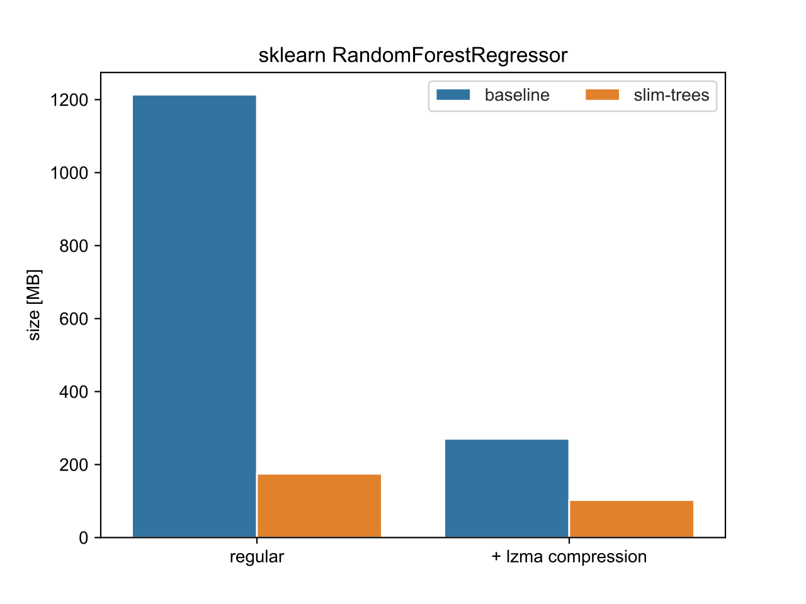

# Slim Trees

[](https://github.com/quantco/slim-trees/actions/workflows/ci.yml)
[](https://anaconda.org/conda-forge/slim-trees)
[](https://pypi.org/project/slim-trees)
[](https://pypi.org/project/slim-trees)

`slim-trees` is a Python package for saving and loading compressed `sklearn` Tree-based and `lightgbm` models.
The compression is performed by modifying how the model is pickled by Python's `pickle` module.

We presented this library at PyData Berlin 2023, check out the [slides](.github/assets/slim-trees-presentation.pdf)!

## Installation

```bash
pip install slim-trees
# or
micromamba install slim-trees -c conda-forge
# or
pixi add slim-trees
```

## Usage

Using `slim-trees` does not affect your training pipeline.
Simply call `dump_sklearn_compressed` or `dump_lgbm_compressed` to save your model.

> [!WARNING]
> `slim-trees` does not save all the data that would be saved by `sklearn`:
> only the parameters that are relevant for inference are saved. If you want to save the full model including
> `impurity` etc. for analytic purposes, we suggest saving both the original using `pickle.dump` for analytics
> and the slimmed down version using `slim-trees` for production.

Example for a `RandomForestClassifier`:

```python
# example, you can also use other Tree-based models
from sklearn.ensemble import RandomForestClassifier
from slim_trees import dump_sklearn_compressed

# load training data
X, y = ...
model = RandomForestClassifier()
model.fit(X, y)

dump_sklearn_compressed(model, "model.pkl")
# or alternatively with compression
dump_sklearn_compressed(model, "model.pkl.lzma")
```

Example for a `LGBMRegressor`:

```python
from lightgbm import LGBMRegressor
from slim_trees import dump_lgbm_compressed

# load training data
X, y = ...
model = LGBMRegressor()
model.fit(X, y)

dump_lgbm_compressed(model, "model.pkl")
# or alternatively with compression
dump_lgbm_compressed(model, "model.pkl.lzma")
```

Later, you can load the model using `load_compressed` or `pickle.load`.

```python
import pickle
from slim_trees import load_compressed

model = load_compressed("model.pkl")

# or alternatively with pickle.load
with open("model.pkl", "rb") as f:
    model = pickle.load(f)
```

### Save your model as `bytes`

You can also save the model as `bytes` instead of in a file similar to the `pickle.dumps` method.

```python
from slim_trees import dumps_sklearn_compressed, loads_compressed

X, y = ...
model = RandomForestClassifier()
model.fit(X, y)

data = dumps_sklearn_compressed(model, compression="lzma")
...
model_loaded = loads_compressed(data, compression="lzma")
```

### Drop-in replacement for pickle

You can also use the `slim_trees.sklearn_tree.dump` or `slim_trees.lgbm_booster.dump` functions as drop-in replacements for `pickle.dump`.

```python
from slim_trees import sklearn_tree, lgbm_booster

# for sklearn models
with open("model.pkl", "wb") as f:
    sklearn_tree.dump(model, f)  # instead of pickle.dump(...)

# for lightgbm models
with open("model.pkl", "wb") as f:
    lgbm_booster.dump(model, f)  # instead of pickle.dump(...)
```

## Development Installation

You can install the package in development mode using the new conda package manager [`pixi`](https://github.com/prefix-dev/pixi):

```bash
❯ git clone https://github.com/quantco/slim-trees.git
❯ cd slim-trees

❯ pixi install
❯ pixi run postinstall
❯ pixi run test
[...]
❯ pixi run py312 python
>>> import slim_trees
[...]
```

## Benchmark

As a general overview on what you can expect in terms of savings:
This is a 1.2G large sklearn `RandomForestRegressor`.



The new file is 9x smaller than the original pickle file.
